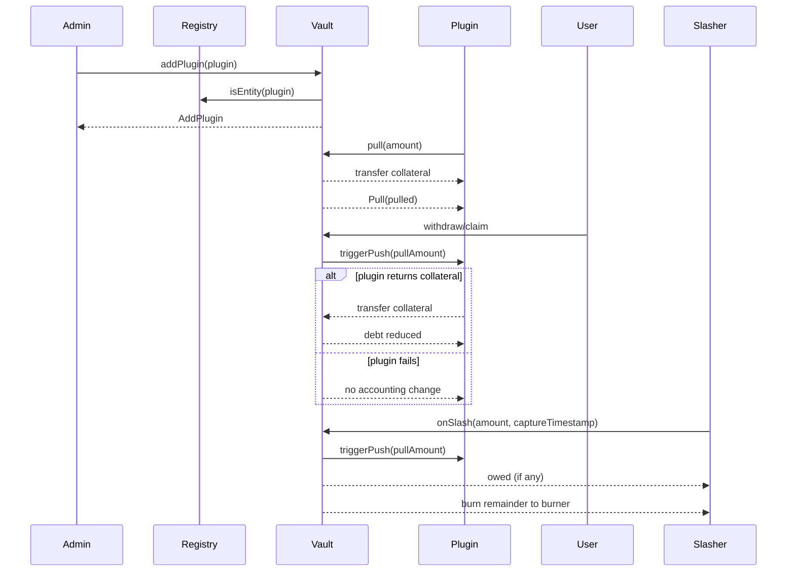

# Liquidity Plugin (Vault V2)

This document describes the liquidity plugin behavior implemented in `src/contracts/vault/VaultV2.sol`.
A plugin is an external contract that can temporarily pull collateral from the vault and later return it.
Vault V2 tracks plugin debt and attempts best-effort recalls when liquidity is needed (withdrawals, claims, slashing).

## Scope

- Vault V2 plugin lifecycle and accounting.
- Pull/push flows and `_pullPlugins` behavior.
- Slashing and withdrawal interactions.
- Trust model and user risk.

## Relevant contracts and interfaces

- `src/contracts/vault/VaultV2.sol`
- `src/contracts/vault/VaultV2Storage.sol`
- `src/interfaces/vault/IVaultV2.sol`
- `src/interfaces/vault/IVaultV2Storage.sol`
- `src/interfaces/vault/IBasePlugin.sol`
- `src/interfaces/IPluginRegistry.sol`
- `src/contracts/PluginRegistry.sol`
- `src/contracts/slasher/UniversalSlasher.sol` (owed slash sync)
- `test/vault/VaultV2.t.sol`
- `test/mocks/MockPlugin.sol`

## Concepts and state

### Plugin registry

- A plugin must be whitelisted in `PLUGIN_REGISTRY` (`IRegistry.isEntity`).
- `PluginRegistry` allows only the owner to whitelist or unwhitelist.

### Plugin list and activation

- `plugins[]` stores active plugin addresses.
- `pluginActiveSince[plugin]` stores activation timestamp; `0` means inactive.
- `pluginsLength()` returns `plugins.length`.
- Removal uses swap-and-pop, so plugin order can change.

### Plugin debt

- `pluginOwe[plugin]` is how much collateral the plugin owes the vault.
- `pluginsOwe` is total owed across all plugins.
- `pull` increases debt; `push` and `_pullPlugins` decrease debt.

### Collateral and stake

- `collateral` is the ERC20 the vault holds and lends to plugins.
- `activeStake()` tracks active collateral backing shares (independent of plugin debt).

## Plugin lifecycle

### Add plugin

`addPlugin(plugin)` (role-gated):

- Requires caller has `ADD_PLUGIN_ROLE`.
- Requires `PLUGIN_REGISTRY.isEntity(plugin)` or reverts `NotPlugin()`.
- Requires `pluginActiveSince[plugin] == 0` or reverts `AlreadySet()`.
- Appends to `plugins[]` and sets `pluginActiveSince[plugin] = uint48(block.timestamp)`.
- Emits `AddPlugin(plugin)`.

### Remove plugin

`removePlugin(plugin)` (role-gated):

- Requires caller has `REMOVE_PLUGIN_ROLE`.
- Searches `plugins[]` for `plugin`.
- Reverts `PluginOwe()` if `pluginOwe[plugin] > 0`.
- Removes by swap-and-pop and sets `pluginActiveSince[plugin] = 0`.
- Emits `RemovePlugin(plugin)`.
- If plugin is not found, reverts `AlreadySet()`.

### Activation semantics

`pull` enforces:

```
if (pluginActiveSince[msg.sender] < block.timestamp) revert PluginNotActive();
```

Because `pluginActiveSince` is set once to `block.timestamp`, this allows pulls only when
`pluginActiveSince == block.timestamp` (same-block activation).
This appears to be the intended on-chain behavior and should be treated as a hard constraint.

## Pull / Push flows

### Pull collateral (plugin borrows from vault)

`pull(amount)`:

- `amount` must be non-zero or reverts `InsufficientAmount()`.
- Caller must be active under the `pluginActiveSince` check or reverts `PluginNotActive()`.
- `pulled = min(amount, activeStake() - pluginsOwe)` using saturating subtraction.
- Transfers `pulled` collateral to the plugin.
- Reverts `FeeOnTransferNotSupported()` if plugin receives less than `pulled`.
- Updates debt: `pluginsOwe += pulled`, `pluginOwe[msg.sender] += pulled`.
- Emits `Pull(plugin, pulled)` and returns `pulled`.

### Push collateral (plugin returns to vault)

`push(amount)`:

- `amount` must be non-zero or reverts `InsufficientAmount()`.
- Transfers `amount` from caller to the vault.
- Decreases debt: `pluginsOwe -= amount`, `pluginOwe[msg.sender] -= amount`.
- Emits `Push(plugin, amount)`.

`push` is not explicitly restricted to active plugins; however, underflow will revert if
`pluginOwe[msg.sender] < amount`.

### Vault-initiated pull-back

`_pullPlugins()` attempts to recall debt from plugins during liquidity-sensitive flows.

Behavior:

- Computes `amount = activeStake() - pluginsOwe` using saturating subtraction.
- Iterates `plugins[]` in order; for each plugin with `pluginOwe[plugin] > 0`:
  - `pullAmount = min(pluginOwe[plugin], amount)`.
  - Calls `IBasePlugin(plugin).triggerPush(pullAmount)`.
  - If `success == true`, reduces `pluginOwe` and `pluginsOwe` by `pullAmount` and decrements `amount`.
  - If `success == false`, no accounting changes are made.
- Best-effort only; no revert on failures.

Because `amount` is zero when `pluginsOwe >= activeStake`, `_pullPlugins` does not request
returns in that case.

## Interactions with withdrawals, claims, and slashing

### Withdrawals

- `withdraw` and `redeem` call `_withdraw`, which updates `activeStake` and withdrawal buckets.
- `_withdraw` then calls `_pullPlugins` to attempt a recall.
- The withdraw itself does not transfer collateral immediately; claim happens later.

### Claims

- `claim` and `claimBatch` call `_claim`, which calls `_pullPlugins` before checking maturity.
- After `_claim`, the vault transfers collateral to the recipient.

### Slashing (`onSlash`)

- `onSlash` adjusts active stake and withdrawal buckets, then calls `_pullPlugins`.
- It computes `instantSlashableStake` based on the vault's current collateral balance minus
  unclaimed withdrawal accounting.
- `owed = slashedAmount - instantSlashableStake` (saturating). If `owed < slashedAmount`,
  the vault transfers `slashedAmount - owed` to the burner.
- A plugin that fails to return collateral increases `owed` for the slasher.

### Sync owed slashes (`syncOwedSlash`)

- `syncOwedSlash(amount)` calls `_pullPlugins` and computes how much of `amount` can be paid
  from the vault's current collateral balance (adjusted for unclaimed withdrawals).
- If no payment is possible, it reverts `InsufficientAmount()`.
- Otherwise it transfers the payable portion to the burner and returns the remaining owed.
- `UniversalSlasher.syncOwedSlash` uses this return value to update per-operator owed amounts.

## Accounting model (debt and limits)

- `pluginsOwe` and `pluginOwe` are the system's debt tracking for collateral pulled by plugins.
- `pull` is limited by `activeStake - pluginsOwe` at the time of pull, so total debt cannot
  exceed active stake at pull time.
- Subsequent slashing or withdrawals can reduce `activeStake` below `pluginsOwe`.
  In that case `_pullPlugins` will not request returns (amount becomes zero), and the vault
  may report higher `owed` during slashing.
- `_pullPlugins` only reduces debt when plugins actively return collateral via `triggerPush`.

## Events and errors

Events:

- `AddPlugin(plugin)`
- `RemovePlugin(plugin)`
- `Pull(plugin, amount)`
- `Push(plugin, amount)`

Errors:

- `NotPlugin()` when adding a non-whitelisted plugin.
- `PluginNotActive()` when calling `pull` while not active.
- `PluginOwe()` when removing a plugin with outstanding debt.
- `FeeOnTransferNotSupported()` when plugin receives less than requested pull amount.
- `InsufficientAmount()` for zero pull/push (and for owed slash sync with no available funds).
- `AlreadySet()` for add/remove misuse (already added or not found on removal).

## Sequence diagram (plugin <-> vault)



## Trust model and user risks

- Plugins are trusted external contracts. If a plugin fails to return collateral,
  users may face delayed or partial liquidity and slashing can report higher `owed`.
- `_pullPlugins` is best-effort and does not revert on failures.
- `triggerPush` success is trusted; the vault does not verify the actual transfer.
  A malicious plugin could return `true` without transferring, corrupting accounting.
- Plugin order is not stable due to swap-and-pop; `_pullPlugins` recall order can change.
- `pull` only works for the activation block due to `pluginActiveSince` gating. Admins and
  plugins must coordinate if this is relied upon.

## Edge cases

- Fee-on-transfer collateral is not supported for plugin pulls.
- `push` underflows (and reverts) if caller's `pluginOwe` is smaller than `amount`.
- `removePlugin` reverts if the plugin is not found (uses `AlreadySet()`).
- Plugins can be added only if whitelisted in `PLUGIN_REGISTRY`.
- `_pullPlugins` only requests returns when `activeStake > pluginsOwe`.
